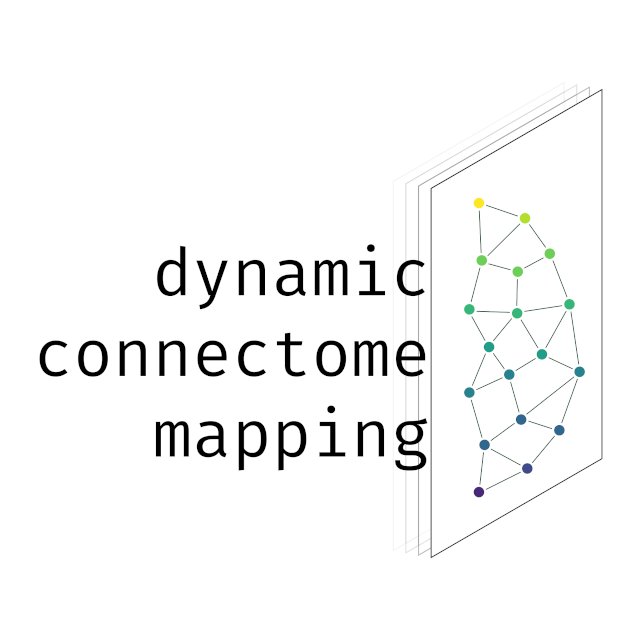

### dyconnmap
A neuroimaging module for dynamic connectome mapping.
 
<table>
 <tr>
  <td>build & code</td>
  <td> 
   
  
   </td>
 </tr>
 <tr>
  <td>package</td>
  <td> 
 
  
 
 
 
 </td>
 </tr>
 <tr>
 <td>release</td>
 <td> 

 

 </td>
 <tr>
 <td>tutorials</td>
 <td> 
  
   
</td>
</tr>

<tr>
 <td>social & updates</td>
 <td> 
  
   
  </td>
</tr>
</table>

---

financially sponsored by [Brain Innovation B.V.](https://www.brainvoyager.com)

---

_dyconnmap_ (abbreviated from “dynamic connectome mapping”), a neuroimaging python module specifically designed for estimating the dynamic connectivity and analyzing complex brain networks; from neurophysiological data such as electroencephalogram (EEG), magnetoencephalography (MEG) and functional magnetic resonance imaging (fMRI) recordings. It includes numerous submodules to work with, such as chronnectomics and graph-theoretical algorithms, (symbolic) time series and statistical methods.

This is an ongoing effort to develop the module further and extend it by adding more algorithms related to graph analysis and statistical approaches. Considering the increasing acceptance and usage of python in analyzing neuroimaging data, we firmly believe that the module will be a great addition in every practitioner's toolbox engaged in brain connectivity analysis.

Built on [NumPy](http://www.numpy.org/), [SciPy](http://www.scipy.org/), [matplotlib](http://matplotlib.org/) and [networkx](https://networkx.github.io/).

#### Workflow outline

#### Publications

* [poster presented @ 13th International Conference for Cognitive Neuroscience in Amsterdam \(ICON2017\)](https://f1000research.com/posters/6-1638)  [under the previous name "dyfunconn"]

#### Resources

* [Installation](https://github.com/makism/dyconnmap/blob/master/INSTALL.md)

* [API Documentation](http://dyconnmap.readthedocs.io/?badge=latest)

* [Tutorials](https://github.com/makism/dyconnmap/tree/master/tutorials)

* [Examples](https://github.com/makism/dyconnmap/tree/master/examples)

#### Citation

If you use _dyconnmap_ or _dyfunconn_ in a published work, please consider citing.

<table align="center">
    <tr>
        <td align="left">1.</td>
        <td align="left">Marimpis, A. D., & Dimitriadis, S. I. (2017). dyfunncon: dynamic functional connectivity–a neuroimaging Python module. F1000Research, 6. https://doi.org/10.7490/f1000research.1114652.1</td>
    </tr>
</table>

