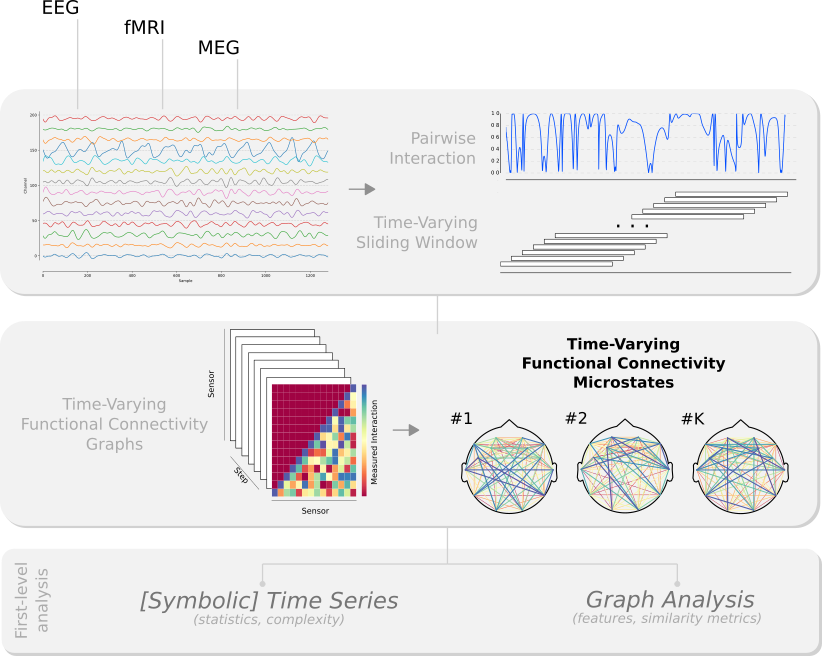

### dyfunconn
A neuroimaging module for dynamic functional connectivity.

_dyfunconn_ is specifically tailored for functional connectivity, synchrony estimators and graph analysis in the context of Functional Connectivity Microstates (FCμstates) analyzing Time-Varying Functional Connectivity Graphs (TVFCGs). The primary focus in the FCμstates paradigm is twofold; to represent the input time-varying connectivity into a small number-repertoire (data reduction) of features (feature extraction) while preserving the temporal dynamics of the connectivity patterns.

Other sudmodules are introduced for analyzing symbolic timeseries, clustering, statistical analyses, etc.

Built on [NumPy](http://www.numpy.org/), [SciPy](http://www.scipy.org/), [matplotlib](http://matplotlib.org/) and [networkx](https://networkx.github.io/) (and some other libs ;P)

* [poster presented @ 13th International Conference for Cognitive Neuroscience in Amsterdam \(ICON2017\)](https://f1000research.com/posters/6-1638) 

#### Workflow outline

---

      
