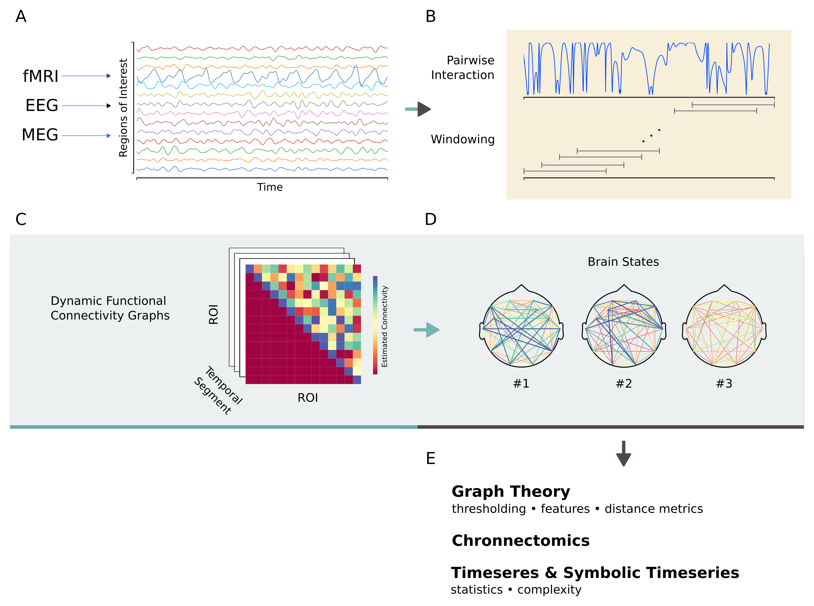

### dyconnmap
A neuroimaging module for dynamic connectome mapping.

     

---

_dyconnmap_ is specifically tailored for functional connectivity, synchrony estimators and graph analysis in the context of Functional Connectivity Microstates (FCμstates) analyzing Time-Varying Functional Connectivity Graphs (TVFCGs). The primary focus in the FCμstates paradigm is twofold; to represent the input time-varying connectivity into a small number-repertoire (data reduction) of features (feature extraction) while preserving the temporal dynamics of the connectivity patterns.

Other sudmodules are introduced for analyzing symbolic timeseries, clustering, statistical analyses, etc.

Built on [NumPy](http://www.numpy.org/), [SciPy](http://www.scipy.org/), [matplotlib](http://matplotlib.org/) and [networkx](https://networkx.github.io/) (and some other libs ;P)

#### Workflow outline

#### Publications

* [poster presented @ 13th International Conference for Cognitive Neuroscience in Amsterdam \(ICON2017\)](https://f1000research.com/posters/6-1638) 

#### Resources

* [Installation](https://github.com/makism/dyconnmap/blob/master/INSTALL.md)

* [Documenation](http://dyconnmap.readthedocs.io/?badge=latest)

* [Tutorials](https://github.com/makism/dyconnmap/tree/master/tutorials)

* [Examples](https://github.com/makism/dyconnmap/tree/master/examples)

#### Cittation

If you use _dyconnmap_ in a published work, please consider citing.

<table align="center">
    <tr>
        <td align="left">1.</td>
        <td align="left">Marimpis, A. D., & Dimitriadis, S. I. (2017). dyconnmap: dynamic functional connectivity–a neuroimaging Python module. F1000Research, 6. https://doi.org/10.7490/f1000research.1114652.1</td>
    </tr>
</table>

